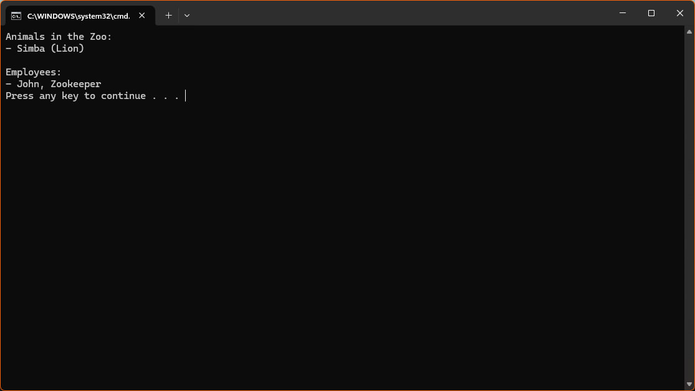
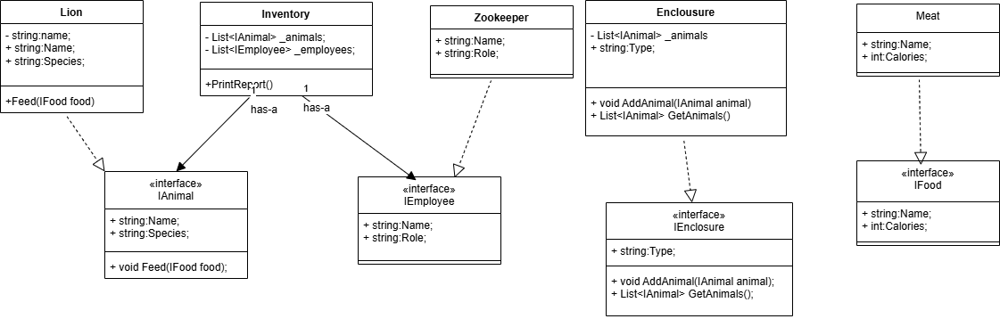

# 📘 Лабораторна робота №1: 

**Варіант 2: Зоопарк

У цій лабораторній роботі реалізована система для обліку тварин, вольєрів, працівників і їжі в зоопарку на мові C#. Вона побудована з урахуванням основних принципів якісного програмування.

---

## ✅ 1. Single Responsibility Principle (SRP)

**Кожен клас має лише одну відповідальність.**

🔹 [`Lion.cs`](./Models/Lion.cs#L3) — опис логіки тварини  
🔹 [`Inventory.cs`](./Services/Inventory.cs#L3) — логіка інвентаризації  
🔹 [`Food.cs`](./Models/Food.cs) — опис корму

---

## ✅ 2. Open/Closed Principle (OCP)

**Класи відкриті для розширення, але закриті для модифікації.**

🔹 Додати нового звіра можна, створивши клас, що реалізує [`IAnimal`](./Interfaces/IAnimal.cs)  
🔹 Нові типи кормів чи вольєрів можна додати без зміни існуючого коду

---

## ✅ 3. Liskov Substitution Principle (LSP)

**Будь-який підтип повинен заміняти базовий тип без порушення логіки.**

🔹 Усі класи тварин реалізують [`IAnimal`](./Interfaces/IAnimal.cs), тому можуть використовуватися в інвентаризації без змін логіки  
🔹 Приклад: [`Inventory.cs`](./Services/Inventory.cs#L10)

---

## ✅ 4. Interface Segregation Principle (ISP)

**Краще кілька вузьких інтерфейсів, ніж один загальний.**

🔹 [`IAnimal`](./Interfaces/IAnimal.cs)  
🔹 [`IEnclosure`](./Interfaces/IEnclosure.cs)  
🔹 [`IFood`](./Interfaces/IFood.cs)  
🔹 [`IEmployee`](./Interfaces/IEmployee.cs)

Кожен клас реалізує тільки необхідний йому функціонал.

---

## ✅ 5. Dependency Inversion Principle (DIP)

**Код залежить від абстракцій, а не від реалізацій.**

🔹 У [`Inventory`](./Services/Inventory.cs) використано інтерфейси:

```csharp
private readonly List<IAnimal> _animals;
private readonly List<IEnclosure> _enclosures;
private readonly List<IEmployee> _employees;
```
Це дозволяє легко замінити конкретні реалізації без зміни логіки.

---

## ✅ 6. DRY (Don't Repeat Yourself)

**Не повторюй себе — кожна частина логіки повинна бути реалізована лише один раз.**

🔹 Загальні властивості тварин винесені в інтерфейс [`IAnimal`](./Interfaces/IAnimal.cs)  
🔹 Єдиний механізм інвентаризації через клас [`Inventory`](./Services/Inventory.cs)  
🔹 Типи об’єктів (корм, працівники, вольєри) винесені в окремі класи, що повторно використовуються

Приклад використання спільного механізму:
```csharp
Inventory inventory = new Inventory(animals, enclosures, employees);
inventory.PrintInventory();
```
---

## ✅ 7. Program to Interfaces, not Implementations

**Код повинен залежати від інтерфейсів, а не від конкретних реалізацій.**

🔹 Усі основні сутності (`тварини`, `вольєри`, `співробітники`, `корм`) представлені через інтерфейси: [`IAnimal`](./Interfaces/IAnimal.cs), [`IEnclosure`](./Interfaces/IEnclosure.cs), [`IEmployee`](./Interfaces/IEmployee.cs), [`IFood`](./Interfaces/IFood.cs)  
🔹 Це дозволяє легко змінювати реалізації без зміни логіки клієнтського коду  
🔹 Зменшує зв'язність коду та спрощує тестування

📄 **Приклад використання інтерфейсів у коді** — [`Program.cs`](./Program.cs#L10):

```csharp
List<IAnimal> animals = new List<IAnimal> { new Lion(), new Elephant() };
```

 **Результат виконання програми**

**UML діаграма**

